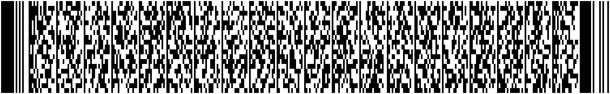

# PDF417 Background Generator

Generates wide, dense PDF417 barcodes suitable for use as decorative backgrounds.
The output is a real PDF417 — a scanner will decode the payload — so it doubles
as a valid barcode and a graphic.



## Install

```bash
pip install pdf417gen Pillow
```

Requires Python 3.8+.

## Usage

Run with defaults:

```bash
python generate_pdf417.py
```

Writes `pdf417_background.png` next to the script.

### Options

| Flag | Default | Description |
|---|---|---|
| `--text` | *(random)* | Payload to encode. If omitted, a random payload is sized to fill the requested grid. |
| `--columns` | `20` | PDF417 data columns, `1..30`. More = wider. |
| `--rows-target` | `8` | Target row count when auto-sizing the random payload. |
| `--security-level` | `4` | Reed-Solomon EC level, `0..8`. Higher = more codewords / denser noise. |
| `--scale` | `3` | Pixel size of one module. |
| `--ratio` | `3` | Module height-to-width ratio (PDF417 modules are tall). |
| `--seed` | `0xBA7C0DE` | RNG seed for the random payload. |
| `--output` | `pdf417_background.png` | Output filename. |

### Recipes

Match the reference image (very wide, ~4:1, dense):

```bash
python generate_pdf417.py --columns 18 --rows-target 20 --security-level 5 --scale 3 --ratio 3
```

Encode your own text:

```bash
python generate_pdf417.py --text "hello world"
```

Higher resolution for print:

```bash
python generate_pdf417.py --scale 6 --ratio 3
```

## Notes

- PDF417 has a hard limit of **928 codewords** (data + EC + descriptor).
  `columns * rows-target` must stay under that.
- Higher `--security-level` consumes more codewords (level `n` uses `2^(n+1)`).
  If you crank EC up, drop `--rows-target` or `--columns` to compensate.
- Modules in PDF417 are taller than wide by design; `--ratio 3` is the
  conventional aspect.
